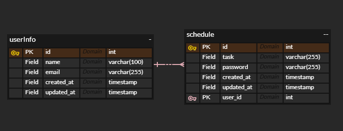

# Schedule
[Spring 5기] CH3 일정 관리 앱 만들기

---
### 📜 개요

스프링부트를 기반으로 3 Layer Architecture와 JDBC만을 사용해 CRUD API를 구현한 일정 관리 프로젝트 
  → 스프링의 기초 개념과 구조적 설계, 기본적인 SQL 쿼리 작성과 데이터 관리 학습

---
### 🛠️ 개발 프로세스

#### 개발 환경
-    

#### 요구사항
- 공통 조건
  - 비밀번호 검증을 통한 수정, 삭제
  - 3 Layer Architecture에 따른 각 계층의 목적에 맞는 설계
  - CRUD는 Database 연결 및 JDBC만을 사용

#### 설계

- API 명세서

  
CREATE

| **기능**    | **Method** | **URL**  | **request**                            | **response**        | **상태 코드**   |
  |-----------|------------|----------|----------------------------------------|---------------------|-----------------|
| **유저 생성** | `POST`     | `/users` | `{ "name": "", "email": "" }` | `사용자 등록 완료` | `201 Created`   |
| **일정 생성**    | `POST`     | `/schedules` | `{ "task": "", "password": "", "userId": "" }` | `일정 생성 완료` | `201 Created`   |

  
READ

| **기능**         | **Method** | **URL**                            | **request** | **response**                                                                                           | **상태 코드**   |
  |----------------|------------|------------------------------------|-------------|--------------------------------------------------------------------------------------------------------|-----------------|
| **전체 조회**      | `GET`      | `/schedules`                       | -           | `{ { "id": "", "task": "", "created_at": "", "updated_at": "", "user_id": "", "user_name": "" } ... }` | `200 OK`        |
| **단건 조회**      | `GET`      | `/schedules/{id}`                  | -           | `{ "id": "", "task": "", "created_at": "", "updated_at": "", "user_id": "", "user_name": "" }`         | `200 OK`        |
| **다건 조회(작성자)** | `GET`      | `/schedules/users/name/{user_name}` | -           | `{ { "id": "", "task": "", "created_at": "", "updated_at": "", "user_id": "", "user_name": "" } ... }` | `200 OK`        |
| **다건 조회(기간)**  | `GET`      | `/schedules/updated`   | -           | `{ { "id": "", "task": "", "created_at": "", "updated_at": "", "user_id": "", "user_name": "" } ... }` | `200 OK`        |

  
UPDATE

| **기능**       | **Method** | **URL**             | **request**                                                                | **response** | **상태 코드**   |
  |--------------------|------------|---------------------|----------------------------------------------------------------------------|-------------|-----------------|
| **일정 수정**      | `PUT`      | `/schedules/update` | `{ "id": "", "updateTask": "", "updateUserName": "", "password": "" }`| `수정 완료`      | `200 OK`     |

  
DELETE

| **기능**       | **Method** | **URL**           | **request**               | **response**          | **상태 코드**   |
  |----------------|------------|-------------------|---------------------------|-----------------------|-----------------|
| **일정 삭제**    | `DELETE`   | `/schedules/{id}` | `{ "password": "" }` | `삭제 완료` | `200 OK`        |

- ERD

---
### 🌱 필수기능

- [x] lv0. API 명세 및 ERD 작성
- [x] lv1. 일정 생성 및 조회
    - 조회: 전체 조회, 수정일 기준 기간 조회, 작성자명으로 검색 조회, 단건 조회(id)
- [x] lv2. 일정 수정 및 삭제
  - 수정, 삭제 요청시 비밀번호로 검증

### 🌴 도전기능

- [x] lv3. 작성자와 일정의 연관 관계 연결
- [ ] lv4. 페이지네이션
- [x] lv5. 예외처리
- [x] lv6. null 체크 및 특정 패턴에 대한 검증 수행

---
### 트러블 슈팅

- [TIL 링크](https://heni0717.tistory.com/19)

---